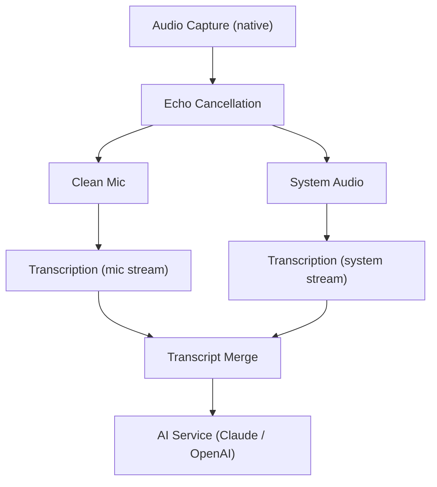

This page gives contributors a bird's-eye view of Raven's architecture - enough to understand the codebase without diving into implementation details.

## The Big Picture

Raven is an **Electron desktop app** with three layers:

| Layer | Role |
|-------|------|
| **Renderer** (React + Tailwind + Zustand) | What the user sees - overlay, dashboard, settings |
| **Preload** (Context Bridge) | Secure IPC boundary between renderer and main |
| **Main Process** (TypeScript + Native) | Audio capture, transcription, AI, database |

## Data Flow

When a user starts a recording:

1. **Native capture** grabs system audio + mic simultaneously (Swift on macOS, Rust on Windows)
2. **Echo cancellation** removes speaker bleed from the mic stream
3. **Dual transcription** sends clean mic and system audio to the transcription provider separately
4. **Transcript merge** combines both streams with speaker labels ("You" / "Them")
5. **AI service** uses the transcript as context for responses

In Raven Pro, the Recall SDK can replace native capture for supported meetings, and AssemblyAI can replace Deepgram as the transcription provider.

## Key Subsystems

| Subsystem | What it does |
|-----------|-------------|
| **Audio Manager** | Orchestrates capture, echo cancellation, and transcription. Handles start/stop lifecycle. |
| **Transcription** | Manages connections to the transcription provider. Merges streams, handles reconnects. |
| **AI Service** | Provider abstraction over Claude and OpenAI. Handles quick actions, typed questions, and screenshot context. |
| **Session Manager** | Creates sessions, auto-saves every 60s, generates summaries, manages history. |
| **Modes** | Loads mode profiles, applies system prompts, manages document context. |
| **Window Manager** | Creates overlay and dashboard windows, manages stealth mode, handles positioning. |
| **Store** | Local settings and data persistence via SQLite and electron-store. |

## The Renderer

The UI is split into two windows:

| Window | Purpose |
|--------|---------|
| **Overlay** | Floating transparent panel - transcript, AI responses, controls, pill |
| **Dashboard** | Main window - session history, settings, mode editor, search |

Both windows communicate with the main process through a single `window.raven` API exposed via the preload script.

## The Native Layer

Audio capture and echo cancellation require native code:

| Platform | Capture | Echo Cancellation |
|----------|---------|-------------------|
| macOS | Swift binary (ScreenCaptureKit + CoreAudio) | C++ addon (GStreamer + WebRTC AEC3) |
| Windows | Rust addon (WASAPI) | C++ addon (GStreamer + WebRTC AEC3) |

The native binaries are built during setup (see the [macOS](/quickstart/macos) and [Windows](/quickstart/windows) build guides).
